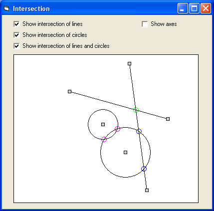



## Intersection of lines and circles

### Description

This code can find intersection of line and circle, line and line, circle and circle. It includes some useful math functions. The code is easy and commented.
 
### More Info
 

             |
---                |---
**Submitted On**   |2006-12-12 21:36:44
**By**             |[Safo](https://github.com/Planet-Source-Code/PSCIndex/blob/master/ByAuthor/safo.md)
**Level**          |Intermediate
**User Rating**    |5.0 (20 globes from 4 users)
**Compatibility**  |VB 6\.0
**Category**       |[Math/ Dates](https://github.com/Planet-Source-Code/PSCIndex/blob/master/ByCategory/math-dates__1-37.md)
**World**          |[Visual Basic](https://github.com/Planet-Source-Code/PSCIndex/blob/master/ByWorld/visual-basic.md)
**Archive File**   |[Intersecti2047672132007\.zip](https://github.com/Planet-Source-Code/safo-intersection-of-lines-and-circles__1-67365/archive/master.zip)

